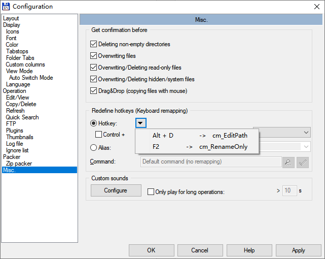
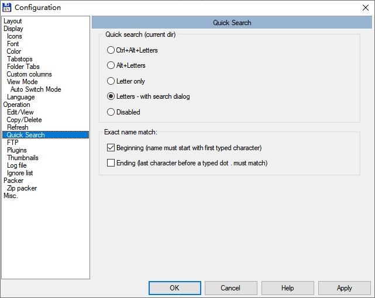
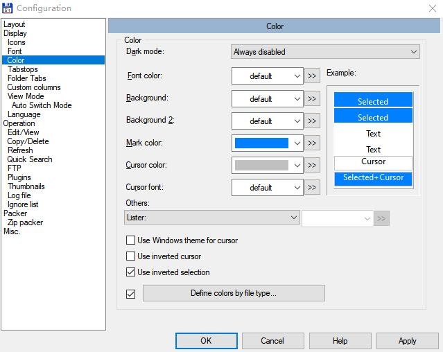

# Total Commander Settings

## Apply Settings

Copy wincmd.ini file to `c:\Users\YOUR_NAME\AppData\Roaming\GHISLER\`

## Configuration

### Enable `Alt + D` for editing path

1. Go to `Configuration > Misc > Redefine hotkeys`
1. Select Alt + D
1. Add Command `cm_EditPath`

### Enable `F2` for rename file/folder

1. Go to `Configuration > Misc > Redefine hotkeys`
1. Select F2
1. Add Command `cm_RenameOnly`

### Enable typing for search

1. Go to `Configuration > Quick Search`
1. Choose `Letters - with search dialog`

### Change mouse selection mode

1. Go to `Configuration > Operation`
1. Go to `Mouse selection mode` section
1. Choose `Left mouse button (Windows standard)`

### Change selection color

1. Go to `Configuration > Color`
1. Edit `Mark color`
1. Select `User inverted selection`

